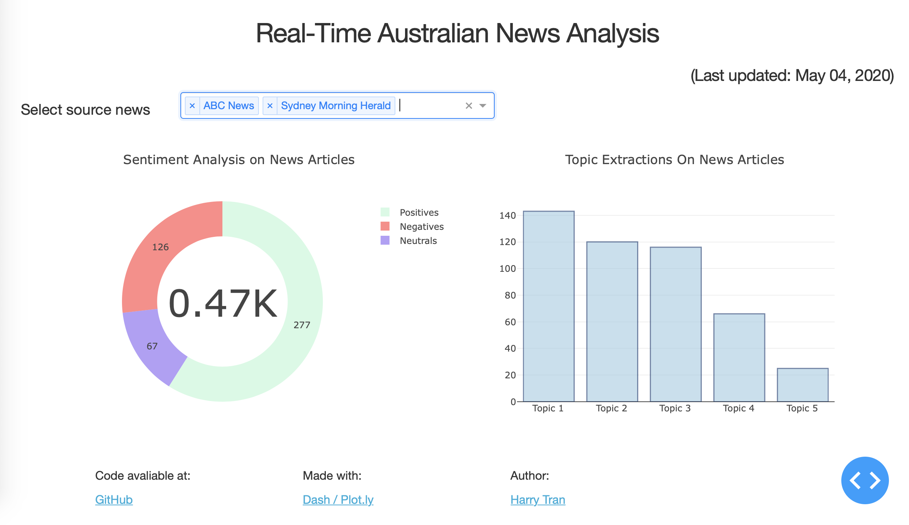

# Australian News Analytics Dashboard

This project intends to analyse reliable Australian source news and displays the statistics with dashboards. More detailed information will be updated soon.

## Last Update (04/05/2020)

Dashboard made with Dash & Plotly

## Update the project progress

- [ ] <b>Crawl the news</b>
  - [x] ABC News
  - [x] The Sydney Morning Herald
  - [ ] The Australian Financial Review
  - [ ] The Australian
  - [ ] The Canberra Times
  - [ ] Daily Telegraph
  - [ ] Northern Territory News
  - [ ] The Courier-Mail
  - [ ] The West Australian
- [ ] <b>Analyze the news</b>
  - [x] preprocess the text
  - [x] sentiment analysis on header
  - [x] sentiment analysis on header + content  
  - [x] topic modelling using LDA
- [ ] <b>Make a dashboarb visualization</b>
  - [x] make a draft dashboard
  - [ ] change bar graph to word cloud
- [ ] <b>Deploy real-time website</b>
  - [x] deploy website
  - [ ] set up continuous deployment
  - [ ] real-time update
- [ ] <b> Monitor website & upgrade plans</b>

## Authors

- **Harry Tran**

## License

This project is licensed under the GNU License - see the [LICENSE.md](LICENSE.md) file for details
